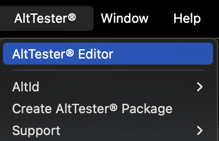
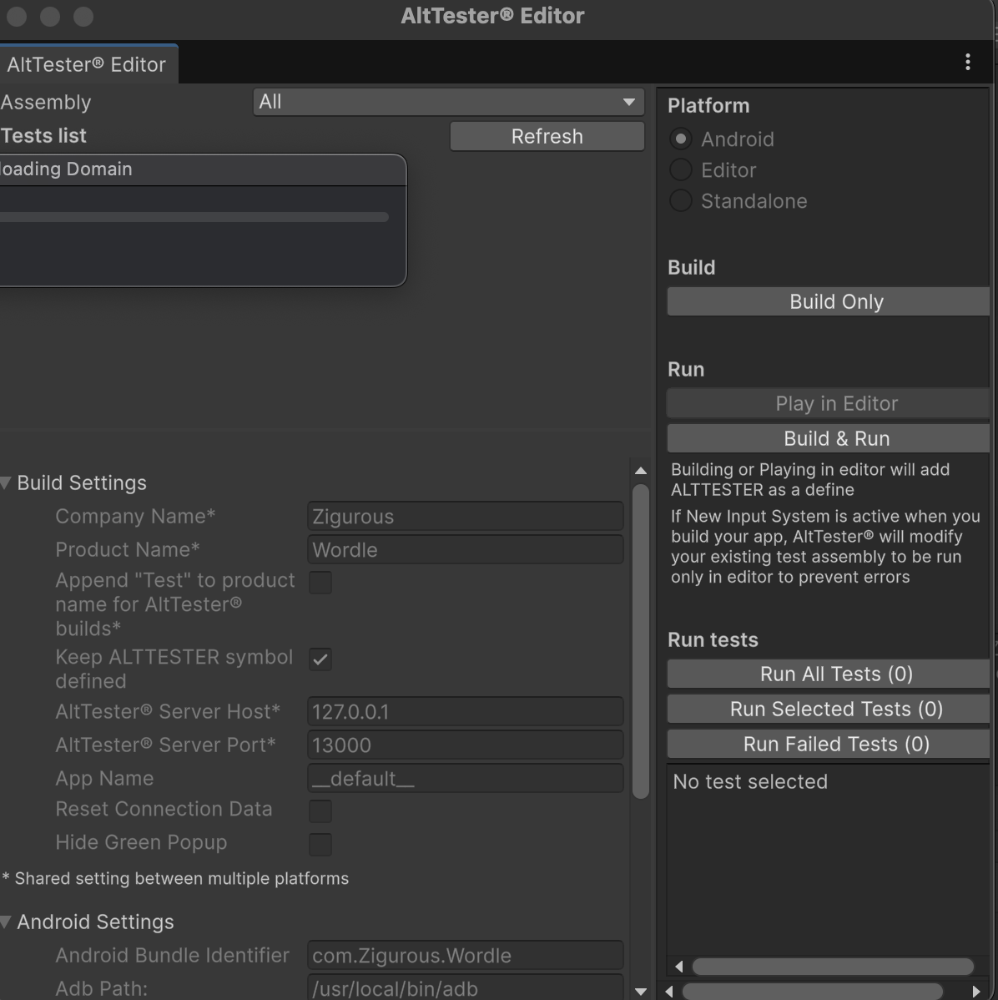

# Agent Zero - Rovix AI Unity SDK

Agent Zero is a powerful Unity package designed to bridge Unity games with the Rovix AI AgentOne system. It provides automated frame-by-frame event reporting, state synchronization, and a robust interface for AI-driven automation using AltTester.

## Key Features

- **Automated Bootstrapping**: Automatically injects and initializes the AI controller into any scene without manual setup.
- **Persistence**: The AI controller persists across scene loads, ensuring continuous communication.
- **Fixed-Step Reporting**: Sends game state events to a Python AI server at configurable intervals.
- **AltTester Integration**: Seamlessly integrates with AltTester for precise game object manipulation and action execution.
- **Testing Framework**: Includes built-in support for testing and validation within the Unity Editor.

## Installation

To add Agent Zero to your Unity project:

1. Open the **Package Manager** (`Window > Package Manager`).
2. Click the `+` icon and select **Add package from git URL...**.
3. Enter the following URL:
   ```
   https://github.com/Rovix-AI/rovix-agentZero-unity.git#v0.1.2
   ```

### Dependencies

Agent Zero requires `Newtonsoft.Json`. If it is missing from your project after installation, please install it via its git URL:
```
https://github.com/applejag/Newtonsoft.Json-for-Unity.git
```

### Setup
Install the SDK
Ensure no Errors are there

Generate and AltTester Build 




Share the build @ ashwani.quark@gmail.com
 or support@rovix.digital

## Support

For issues or feature requests, contact [Rovix Digital Support](mailto:support@rovix.digital) or visit [rovix.digital](http://www.rovix.digital).
